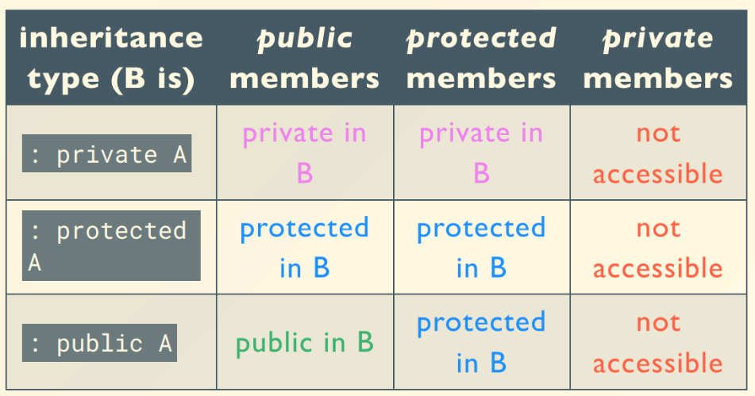

## OOP-Review

[TOC]

> 考expect那个错误的嵌套好像挺多的
>
> 也讲了C++标准库的一些数据结构（vector、map等）。C++的std库里很多东西都没讲
>
> 期末考就3，4个固定的考点，算是比较简单的考点也比较固定，多做一些历年卷即可。印象中常考的考点是：**构造、析构的顺序，多态（静态绑定和动态绑定），函数重载的优先级，模板的语法，new的内存分配和回收**


文本填空题：严格的文本检查，建议copy题目

程序填空题：编译结果和标答一样可以

选择题

设计题：要多写一点，主观题，人工判 20分


#### 1. C++的新特性

元素的初始化顺序不取决于它们在列表中的声明顺序。实际上，初始化列表中的元素初始化顺序是根**据编译器的具体实现而确定的**  

类成员是按照在类里被声明的顺序初始化的，与初始化表中列出的顺序无关

初始化：`int a[10] = {1};`非零的情况下只有第一个会被赋为1，其他全部为0

##### 1.0 输入输出流

==`<<`能够输出所有基本类型，包括指针==，  ==Manipulators是被插入或者在流种提取的对象==

##### 1.1 变量和动态内存分配

- global variable 全局变量，存储在**全局变量区** 
  - 可以使用关键字`extern` 来使用别的cpp文件中的全局变量
- static global variable **静态全局变量**，不能在cpp文件之间共享
- local variable 存储在**栈**区上
- static local variable 静态局部变量
  - 存储在**静态全局变量区**
  - 在初次使用的时候初始化
- allocated variable 动态分配的变量
  - 存储在内存的**堆**结构中

```c++
string s="hello";
string *ps=&s;
// 下列3行代码输出结果一致
(*ps).length(); //，不包含'\0', 比如这条输出为5
ps->length();  
cout<<strlen("hello");

string s2(8,'x');  //字符串中包含8个x
```

- C++动态内存分配
  - new用于动态分配内存给变量，如`new int`，`new double[1000]`

    - **malloc不执行类的构造函数**，而new出新的对象的时候会执行对象的构造函数`new Class_Name[n]`会**执行$n$次**Class_Name的构造函数

      > 1. `new` is an operator, while `malloc` is a function.
      > 2. `new` calls an appropriate constructor for object allocation, while `malloc` doesn't.
      > 3. `new` returns a pointer with the appropriate type, while `malloc` only returns a `void *` pointer that needs to be typecasted to the appropriate type.

    - **内存泄漏** Memory Leak

      ```cpp
      int *p = new int;
      *p = 123;
      p = new int;
      ```

      上面这段代码中一开始为指针p分配了一段内存空间并赋值了123，但是第三行代码又为p赋值了一段新的内存空间，原来的内存空间存储了123，但是这一段内存空间已经没有指针指向，因此**不能访问，也不能删除**，造成了内存泄漏

  - delete用于删除动态分配的内存
    - 用法 `delete p; ` ==`delete[] p;`==（对应于如， `p =  new double [n]`）

    - 和new类似，delete会执行所删除对象的**析构函数**(`free`则不会执行析构函数),不能delete没有定义过的变量，同一个变量不能delete两次

    - 两个指针p1,p2指向同一个数据，如果p1被delete了，p2也不能访问原本p1指向的变量的值，因为**delete删除的是内存里的数据**（==相当于清空内存，并且收回；相同指向的指针重复释放会有问题==）, 而不是变量名

      ```cpp
      int *p1 = new int;
      int *p2 = new p1;
      *p2 = 1;
      delete p1;
      cout<<*p2<<endl; // error!!!
      
      // 创建一个由20个指针组成的二维数组
      int **arr = new int *[20];
      ```


##### 1.2 引用 Reference

- 给**变量**(引用的对象**不能**是表达式)取了一个别名，使用方法为`type &refname = name;` （需要立刻赋值**初始化** ，并且一旦引用被初始化为一个对象**就不能更改** ）
- 引用和指针的区别
  - 不能定义**空引用**，引用必须连接到一块合法的内存

```c++
int x;
int *f(int *x){
    (*x)++;
    return x;
}
int &g(int &x){
    x++;
    return x;
}

int &h(){
    return x;
}
int main(){
    int a=0;
    f(&a);
    g(a);
    h()=16; //这里全局变量x被赋值为16
}


#include <iostream>
using namespace std;
int& f(int &i ){
	i += 10;
    return i ;
}
int main(){
	int k = 0;
    int& m = f(k);
	cout << k << "#";
    f(m)++;
	cout << k << endl;
    return 0;
}
// 输出10#21
```


##### 1.3 const类型

- ==必须初始化，并且初始化之后就不能改变其值==，const型变量不能在连接单元外使用

- 数组的定义时的长度值必须在**编译期**就已知，所以宏定义中的常数可以作为数组长度，而`int n; int a[n]`这样的语法就是错误的，不过现在似乎有了编译器优化，在Dev-cpp中这样写也可以通过编译

  ```c++
  const int size=100;
  int a[size];//OK
  
  int x;
  cin>>x;
  const int size=x; //在 C++ 中定义数组时，必须在编译时知道其大小 , 而这里的x不是编译时常量
  int a[size];//Error!!!
  ```
  
- const和指针pointer

  ==记忆技巧：const和他最近的一个非变量组合，同时有*和type，type优先==

```c++
//第一种情况：const和*组合   是q是一个const指针,指向的地址不能改变，但是q指向的东西可以变
char * const q ="abc";
*q='c'; // OK
q++; // Error!
//第二种情况下：const和char组合  (*p)是一个const的值;但可以可以修改指针的值，使其指向其他const char对象
const char *p =  "abc";
char const *p = "abc";
*p="c";//error!  ''则会现实类型错误❌
p = "c";// 正确，相当于换了个指向的地址

// const内容
const char *p = "abc";
char *q;
q = p; //Error: invalid conversion from ‘const char*’ to ‘char*’ 
*q = 'c';
```

- 可以把非const类型的值赋给对应的const型变量，函数中可以将参数设置为const类型表明这些参数在函数中不能被修改原本的值，也可以将返回值类型设置为const表示返回值不能被修改

```c++
// typename 用于标明这个是类型名
void function(const typename *p);//可以让函数虽然能得到地址，但无法修改变量
```

- ==`char * s="Hello World!";`实质上是`const char *`类型==，不要去修改s中的内容，这是一种**未定义的行为**(undefined behavior)，应该写成 `char s[]="Hello World!";` 

```c++
#include<iostream>
using namespace std;
int main(){
    char *s1="Hello World";
    const char *s2="Hello World";
    
    cout<<(void*)s1<<endl;
    cout<<(void*)s2<<endl;
    return 0;
    //输出的结果是s1和s2的地址，他们的结果是一样的
}
```


被常量函数调用和被非常量函数调用

```c++
class MyClass {
public:
    MyClass(int x): val(x) {}
    void Print() const { cout << 1 << val; }
    void Print() { cout << 2 << val; }
private:
    int val;
};

int main() {
    const MyClass obj1(10);
    MyClass obj2(20);
    obj1.Print();
    obj2.Print();
    return 0;
}
输出110 220
```


const类不能调用非const但是能调用static函数

```c++
#include <iostream>
using namespace std;
class A{
public:
    static void f(double){
        cout << "f(double)" << endl;
    }
    void f(int){
        cout<< "f(int)" << endl;
    }
};
int main(){
    const A a;
    a.f(3);
}
f(double)
```

##### 常引用

不能通过常引用去修改其引用的内容，但是可以通过其本身修改
``const type &``不能用来初始化``type &``


#### 2. 类 class

> 对象之间的相互交流是通过 calling member functions 实现的
>
> 类不是函数的集合, 而是需要有实例
>
> 声明类只是声明了一种类型，不存储具体值；只有定义了对象后才分配空间

##### 2.0 类的基本概念

- **objects=attributes+operations**

##### 2.1 构造函数和析构函数

- constructor 构造函数

  > 父类静态
  >
  > 子类静态
  >
  > 父类属性
  >
  > 父类构造函数
  >
  > 子类属性
  >
  > 子类构造函数
  >
  > 
  >
  > static局部对象，只在第一次构造，main函数结束的时候析构
  >
  > 处于同一层次的各基类构造函数执行顺序，取决于声明派生类时所指定的各基类顺序，与初始化列表无关
  >
  > （可以理解成先造出虚表，再一级级向下）

  - ==构造函数和析构函数不能继承==
  - default constructor 默认构造函数，==构造函数可以有参数，一个类可以有多个构造函数==
  - 初始化列表：在函数签名后面，大括号之前直接对类中定义的变量进行赋值
    - const类型的成员变量初始化**只能用初始化列表** 
    - 构造函数的执行分为两个阶段：初始化阶段和函数执行阶段，会先执行初始化列表里的赋值，在进入函数主体进行对应的操作
  
  ```c++
  //A a[n] 则构造函数会被调用n次!
  ```
  
- Destructor 析构函数

  在类的生命周期结束的时候会**被编译器自动调用** 

- function overloading 函数重载：

  - **函数名相同**而参数的个数和类型不同的几个函数构成重载关系，**一个类可以有多个不同的构造函数来解决不同情况下的构造**

- constant object常量对象

  - 需要加const声明，在声明之后就不能改变这个对象内部变量的值
  
  - 会有一些成员函数不能正常使用
  
  - **在成员函数参数表后面加const可以成为const型成员函数，const类型的成员函数不能修改成员变量的值**
    - const声明写在函数的**开头**表示函数的返回值类型是const
    
    - const声明写在函数签名的**末尾**表示这个成员函数**不能修改类中定义的成员变量**，被称为**常成员函数** 
    
      - 但是如果是成员变量中有指针，**并不能保证指针*指向的内容*不被修改**
    
      - const类型的函数和非const类型的函数也可以构成重载关系，比如：
    
        ```c++
        class A {
        public:
            void foo() {
                cout << "A::foo();" << endl;
            }
            void foo() const {
                cout << "A::foo() const;" << endl;
            }
        };
        
        int main(){
            A a;
            a.foo(); //访问的是非const类型的foo
            const A aa;
            aa.foo(); //访问的是const类型的foo
            return 0;
        }
        ```
        
      - const类型的成员函数的使用规则如下：
      
        - non-const成员函数不能调用const类型对象的成员变量，而const类型可以访问
        
        - 构成重载关系的时候，const类型的对象只能调用const类型的成员函数，不能调用non-const，但是可以static
        
          而非const类型的对象**优先调用non-const的成员函数**，**如果没有non-const再调用const类型的**


- copy constructor拷贝构造函数（==`class (const class& copy_var)`==）

  ==记住下面的拷贝构造函数和赋值函数是怎么写的==
  
  ```c++
  class A {
    A() {}  
    A(const A& a) {} // 拷贝构造函数（用引用来记忆），一般为class (const class& copy_var)
    A& operator=(const A& a) {
        return *this;
    }
  };
  
  int main(){
      A a; 
      A b = a; //定义变量时直接给变量用同类型的变量赋值，调用拷贝构造函数
      A c;
      c = a; //定义之后再赋值，调用重载之后的=; 赋值运算符只能使用于已经存在的对象，也就是进行赋值之前，这个对象已经被某个构造函数构造出来了
  }
  
  // 一个具体的例子
  Array& operator=(const Array& that) {
          if (this != &that) {
              size = that.size;
              delete [] data; // 一定要释放原来的空间！
              data = new int[size];
              for (int i = 0; i < size; i++) {
                  data[i] = that.data[i];
              }
          }
          return *this;
      }
  ```
  
- C++中的拷贝：**浅拷贝**和**深拷贝** 
    - 浅拷贝：在原来已有的内存中增加一个新的指针指向这一段内存（由缺省的拷贝构造函数所实现的数据逐一赋值，若类中含有指针数据则会产生错误**缺省的拷贝构造函数和赋值运算=符进行的都是浅拷贝**）
    - 比如`string s1="zyc"; string s2(s1);`  就是一种浅拷贝 
    - 深拷贝：分配一块新的内存，复制对应的值，并定义一个新的指针指向这一块内存
    
    默认的拷贝方法就是把相同类的所有成员都逐个拷贝
  
  > 3. Which function will not be created by compiler if not defined explicitly?    (  D )
  >
  > a. constructor function                 b. destructor function
  >
  > c. copy constructor function             d. inline function
  
  ```c++
  #include<cstring>
  #include<iostream>
  using namespace std;
  
  struct Person{
      char *name;
      // 浅拷贝，p1.p2的析构会出现 double free的问题
      Person(const char *s){
          name=new char[strlen(s)+1];
          strcpy(name,s);
      }
      // 把下面这个现在被注释掉的函数恢复，其他代码不变。p1，p2是深拷贝，不再出现double free的问题
     	//Person(const Person& other) {
        //  name = new char[strlen(other.name) + 1];
          //strcpy(name, other.name);
      //}
      ~Person(){
          delete[] name;
      }
  };
  
  int main(){
      Person p1("Trump");
      Person p2=p1;
      cout<<(void *)p1.name<<endl;
      cout<<(void *)p2.name<<endl; //会发现输出的地址是一样的
      return 0;
  }
  ```

> 切片 slice
>
>  `p` 是基类 `A` 的引用，当执行 `p = b` 时，只会复制 `A` 类的成员变量和成员函数，而不会复制派生类 `B` 的特有成员变量和成员函数

##### 2.2 static类型

- 类中的成员(变量和函数)分为两种
  - **静态成员 static**：在类内==所有对象之间共享==, 存储在全局变量区
  - **静态函数不能访问实例成员**  静态成员不需要通过对象就能访问
  
  **static类型的全局变量只在当前文件有效，不能通过extern跨文件调用**，而函数中的static类型的变量在**第一次调用**的时候会被初始化，之后再调用该函数这个static类型的变量**保持上一次函数调用结束时的值** 

```c++
#include<iostream>
using namespace std;

class A{
    static int count;
    public:
    	A() {cout<<"A::A()"<<endl;}
    	~A(){cout<<"A::~A()"<<endl;}
};

void f(int n){
    if(n >10)
    	static A a;
    cout<<"f()"<<endl;
}
int A::count = 0; //必须在外部再申明一次，别忘了写一下数据类型int
int main(){
    f(1);
    f(11); 
    f(12);
    return 0;
}
//无论什么情况，A的构造和析构函数只会被执行一次
输出
f()
A::A()
f()
f()
A::~A()
```

- 类中的static
  - 类中定义的static类型的变量是**静态成员变量**，其值会在这个类的**所有成员之间共享** 

    non-const类型的静态成员变量需要在类的外面进行定义（**不能用初始化表赋值**），比如：

    ```c++
    #include <iostream>
    using namespace std;
    
    class A {
    public:
        static int count;
        A() {
            A::count++;
        }
    };
    
    int A::count = 1; // 在类的外部赋值的时候不需要说明static，但是需要注明A::，否则就是一个新的变量。 不能在定义的时候就赋值初始值， 如果不在外面赋值也会报错
    
    int main(){
        A* array = new A[100];
        cout<<A::count<<endl;
    }
    // 输出101
    ```

  - 静态成员函数（函数定义之前加static关键字）：
    - ==**只能访问类定义中的静态成员变量**，但是**不能直接访问普通的**成员变量==

##### 2.3 Inline Function内联函数

- 需要在函数名前面加关键字`inline` 
  - 内联函数在**编译期**会被编译器在调用处直接扩展为一个完整的函数，因此可以减少运行时调用函数的代价
  - 内联函数的定义和函数主体部分都应该写在**头文件**中
  - 本质是==空间换时间==
  - ==class中的函数都是**默认inline**的==
- an inline function is expanded in place, like a preprocessormacro, so the overhead of the function call is eliminated,不需要函数调用产生的开销，由编译器**直接优化**，但是可能会使得需要编译的代码量增大(虽然写的人是看不出来的)，主要作用是减小函数调用时的开销，一般在函数比较小的时候才会使用

##### 2.4 继承Inheritance

- composition 组合：把其他的类作为自己的成员变量

- Inheritance：从基类中继承生成派生类， ==一个类可以有超过一个父（super class)==
  - 派生类**继承了基类的所有变量和成员函数** ，==不能继承赋值运算，构造函数，析构函数==
  
  - 派生类中**不能直接访问**基类的==private的变量和成员函数==，**但是可以通过基类的成员函数来访问这些成员函数和变量**
  
  - 派生类的构造函数
    
    **slice off**
    
    1. 子类对象可以赋值给父类对象
       ``f = s;``
    
    **Up-casting**（向上造型）
    
    1. 子类对象可以初始化父类引用
       ``father &fr = s;``
    2. 子类对象的地址可以赋值给父类指针
       ``father *fp = &s``
    
    声明为指向基类对象的指针，当其指向公有派生类对象时，只能用它来直接访问派生类中从基类继承来的成员，而不能直接访问公有派生类中定义的成员！！！！重要！！！
    
    ```c++
    class A {
    public:
        int i;
        A(int ii = 0): i(ii) {
            cout<<"A(): "<<i<<endl;
        }
    }a;
    
    class B: public A {
    public:
        int i;
        A a;
        B(int ii = 0): i(ii) {
            cout<<"B(): "<<i<<endl;
        }
    };
    
    int main(){
        B b(100);
        return 0;
    }
    //
    A(): 0	//构造了一个全局的a
    A(): 0 
    A(): 0 // B中有个成员A a， 因此这里第二次调用了构造函数
    B(): 100
    ```
    
  - 派生类中可以对基类函数进行重载，此时如果派生类对象调用对应的函数按**照派生类中的同名函数执行**
    
    - 仍然调用基类的方法`object.Base::function()` 
    
  - class和struct的区别：class中的变量和函数**默认为private**，struct中的函数默认为public(两者都需要以`;`结尾)
  
  - 访问控制
    - public：所有情况下可见
    - protected：可以被自己/派生类和友元函数访问
    - private：对于自己和友元函数可见
    
  - 继承的种类：public，private，protected继承（默认是private），继承之后的基类变量的访问控制取原本类型和继承类型中较严格的
  
  
  
  ==`private`只能自己的成员函数，友元函数，友元类的成员函数可以访问==
  
  如果成员（变量和函数）没有申明，默认**private**
  


##### 2.5 友元 friend

- 友元函数
  - 在类中声明一个全局函数或者其他类的成员函数为`friend`
  - 可以使这些函数拥有访问类内private和protected类型的变量和函数的权限
  - 友元函数也可以是一个类，这种情况下被称为是友元类，整个类和所有的成员都是友元
  - 友元函数本身不是那个类的成员函数，函数签名里不需要`className::`来表示是这个类的成员函数，直接作为普通函数即可
  - ==不能继承==， 友元是单向的
  
  ```c++
  class Time //定义Time类
  {
  public:
  Time(int,int,int);
  void display(Date &); //display是成员函数，形参是Date类对象的引用
  private:
  int hour;
  int minute;
  int sec;
  };
  
  class A {
  private:
      int val;
  public:
      A(int value): val(value) {
          cout<<"A()"<<endl;
      }
      friend void showValue(A a);
      friend void Time∷display(Date &); //如果是其他类的还要加上 ::
      friend B;// 友元类，则B类中所有函数都是A类的友元函数，可以访问A类中所有的成员
  };
  
  void showValue(A a){
      cout<<a.val<<endl;
  }
  ```


##### 2.6 多态和虚函数

- 多态 Polymorphism

  四类多态
  参数多态：函数模板和类模板
  包含多态：虚函数
  重载多态：函数重载，运算符重载
  强制多态：强制类型转换
  
  
  
  有继承关系的类之间有函数构成重载关系，依然会根据变量类型来调用对应的函数，比如：
  
  ```c++
  #include <iostream>
  using namespace std;
  
  class A{
  public:
      virtual void foo() {
          cout<<1<<endl;
      }
  };
  
  class B: public A{
  public:
      virtual void foo() {
          cout<<2<<endl;
      }
  };
  
  int main(){
      A a;
      B b;
      a.foo();
      b.foo();
      return 0;
  }
  输出 1  2
  //即A型的变量的foo函数是基类中的，B类型的变量的foo函数是派生类中的
  ```
  
  - **静态绑定** **Static Binding**(==默认为静态==)
  
    能够明确运行的是哪个类的方法时会发生静态绑定
  
    发生在编译时刻，所以又叫早绑定
  
  - **动态绑定** **Dynamic Binding**
  
    出现**多态**，编译器不能明确到底使用哪个类的方法时发生动态绑定
  
    发生在运行时刻，所以又叫晚绑定
  
    只有存在==`virtual`==且通过==指针或者引用==访问时，才会发生动态绑定
  
- 虚函数 Virtual Function (动态链接 dynamic binding)  ``virtual``只在类定义的函数声明中，写函数体时不用

  - 通过基类访问派生类定义的函数。 如果把基类的函数声明为``virtual``，派生类derived class的函数不声明``virtual``也行（自动）， 虚函数是动态成员函数。 

  - 用于区分派生类中和基类同名的方法函数，需要将**基类**的成员函数类型声明为==virtual==
    
    - ==*构造函数*不可能定义*为虚函数*（友函数，静态成员函数，内联函数也不能为虚函数）==，因为构造时必知对象类型
    - 当实例化子类时，检测到有虚函数的重写，编译器会用子类重写的虚函数地址覆盖掉之前父类的虚函数地址，当调用虚函数时，检测到函数是虚函数就会从虚表中找对应的位置调用，若子类没有重写，虚表中的虚函数地址就还是父类的，若子类中有重写，虚表记录的就是子类重写的虚函数地址，即实现了父类的指针调用子类的函数
    - 虚表中先记录父类中的虚函数地址，接着记录子类中虚函数地址(**若子类重写父类的虚函数则是覆盖**)
    
    ##### 虚析构函数
    
    ==通过指针删除子类对象时，**通常情况下只调用父类的析构函数**==
    如果把基类的析构函数声明为``virtual``，派生类derived class的析构函数不声明``virtual``也行（自动），再执行该操作时，先调用子类的析构函数，再调用父类的析构函数（定义virtual才会一级级向上，是正常的）
    一般来收都会把析构函数定义为虚函数
    
  - **纯虚函数**：`virtual int func() = 0;` 表明该函数没有主体，基类中没有给出有意义的实现方式，**需要在派生类中进行扩展**  
  
  纯虚函数可以没有函数实现，有纯虚函数的类不能实例化对象，继承有纯虚函数的父类的子类必须在子类中实现它，子类才能实例化对象，如果不在子类中实现它，子类也不能实例化对象
  
  抽象类，有纯虚函数的类就是抽象类
  
  - c++11之后子类的virtual可以改成`override`
  
  ```c++
  virtual void move() { std::cout << "Cir::move()\n"; }
  void move() override { std::cout << "Cir::move()\n"; }
  ```
  
  - 虚函数需要借助指针和引用达到多态的效果
  
    - 子类的==指针==可以赋给父类，子类的对象可以赋给父类==引用==
  
      - 当通过指针调用父类和子类中的同名虚函数时，调用的虚函数是哪个，**视指针指向哪里**
      - 引用调用同名虚函数时，调用的虚函数是哪个，**视引用的哪个决定**
  
      在非构造/析构函数的成员函数中调用虚函数，是多态；==在构造函数/析构函数中调用虚函数就**不是多态**==， 编译时即可确定，调用的函数是自己的类或基类中定义的函数，不会等到运行时才觉得调用自己的还是派生类的函数
    - 派生类指针**不能**指向基类
  
  - 虚函数的实现方式：**虚函数表** virtual table 
  
    - 每一个有虚函数的**类**都会有一个虚函数表，该类的任何对象中都存放着虚函数表的指针，虚函数表中**列出了该类的虚函数地址** 
      - 虚函数表是一个**指针数组**（==array of pointers==放指针的数组，起始也是0），里面存放了一系列虚函数的指针
      - 虚函数的调用需要经过虚函数表的查询，非虚函数的调用不需要经过虚函数表
      - 虚函数表在代码的编译阶段就完成了构造
      - **一个类只有一张虚函数表**，每一个对象都有指向虚函数表的一个指针`__vptr` （有virtual就有虚表，==占4个指针==, ==子类继承了父类所有的变量==）
    - 多态的函数调用语句被编译成一系列根据基类指针所指向的对象存的虚函数表的地址，在从虚函数表中查找地址调用对应的虚函数
    - 继承的时候，虚表的指针顺序不会改变，只会增加
  
- 接口(C++**抽象类**， ==抽象类就是一个至少有一个纯虚函数的类==)

  - 抽象类只能作为父类，**不能独立创建对象**，==此时这个类的大小就和类中元素大小相同（因为不存在虚表）==
  - 可以作为指针或者引用来调用子类
  
  如果一个类没有成员变量，且所有函数都是虚函数（除了可以有一个空的析构，没有静态变量），则它成为一个`interface`类

##### 2.7 虚函数使用总结

- virtual的虚函数关键字是**向下负责**的，派生类声明virtual对基类无任何影响

- ==对于指针和引用而言==（如果直接是==子类赋值给**基类实体**，**无脑调用原变量的类型**==）

  ```
  子类的函数调用
  1. 子类的函数和子类能够隐式转换的函数
  2. 再去父类里面找
  ```

  - **派生类指针不能直接指向基类的对象（事实上，所有的由派生类到基类的都不行）**
  - 如果虚函数里还需要调用其他函数，调用的规则也和上面的一样
  
- 历年卷上的一个题目：写出程序的输出

  ```c++
  class B {
  public:
      void f() {
          cout << "bf" << endl;
      }
      virtual void vf() {
          cout << "bvf" << endl;
      }
      void ff() {
          vf();
          f();
      }
  };
  
  class D: public B {
  public:
      void f() {
          cout << "df" << endl;
      }
      void ff() {
          f();
          vf();
      }
      void vf() {
          cout << "dvf" <<endl;
      }
  };
  
  int main(){
      D d;
      B* pb = &d;
      pb->ff();
  }
  //调用ff，因为ff也不是虚函数，所以调用B中的ff，B中的ff调用了vf和f，而vf是虚函数，B类型指针指向的是D，所以调用D中的vf，输出dvf，调用f则和上面一样输出bf
  dvf
  bf
  ```
  
- **默认变量由object, pointer 或者 reference的静态类型决定**

```c++
#include <iostream>
struct A{
    virtual void foo(int a = 1) {
        std::cout <<"A"<< '\n'<< a;
    }
};
struct B :A{
    virtual void foo(int a = 2) {
        std::cout <<"B"<< '\n' << a;
    }
};
int main () {
    A *a = new B;
    a->foo();
}
输出为 B 1
```

- ==函数类型一致才会构成多态关系==，或者后面多了个==const==，比如下面一段代码中

  ```cpp
  class A {
  public:
      virtual void f(int i) {
          cout << 1 <<endl;
      }
  };
  
  class B: public A {
  public:
      virtual void f(double i) {
          cout << 2 << endl;
      }
  };
  
  int main(){
      A* pa = new B;
      pa->f(1);
      return 0;
  }
  // 这里输出的结果是1，事实上两个f并不构成虚函数的关系，因为f(1)中1是int类型，所以优先调用了对int匹配度高的
  // 事实上如果是f(1.1)输出的结果仍然是1，并且CLion会提示参数需要类型转换
  // 事实上两个f不构成虚函数的多态关系，所以调用哪个并不看指针指向的对象，而是看指针本身的类型！
  ```

- **delete 谁的指针就会调用谁的析构函数**，如果释放父类指针(指向子类的父类指针)，==**只会调用父类的析构函数**==，将父类的析构函数声明为虚函数(虚析构，加 virtual 修饰的析构函数)，就会先调用子类的析构函数再调用父类的析构函数（就是上面说的虚析构）

```c++
class MyClass{
public:
	MyClass(int id) { cout << "MyClass::Ctor\n"; }
	~MyClass() { cout << "MyClass::Dtor\n"; }

private:
	int id;
};

class Base{
public:
	Base(int _id):myclass(_id) { cout << "Base::Ctor\n"; }
	~Base() { cout << "Base::Dtor\n"; }
	virtual void foo() { cout << "Base::foo\n"; }
private:
	MyClass myclass;
};

class Derived : public Base{
public:
	Derived(int _id):Base(_id){ cout << "Derived::Ctor\n"; foo(); }
	~Derived(){ cout << "Derived::Dtor\n"; foo(); }
	virtual void foo() { cout << "Derived::foo\n"; }
private:

};

int main(){
	Base* p = new Derived(10);
	delete p;
	return 0;
}

MyClass::Ctor
Base::Ctor
Derived::Ctor
Derived::foo
Base::Dtor
MyClass::Dtor
```


```c++
#include <iostream>
using namespace std;

class A {
    int i;
public:
    A() : i(0) {}
    virtual void set(int i) { this->i = i; }
    virtual int get() { return i; }
};

class B : public A {

public:
    int i;
    B() : i(10) {}
    virtual void set(int i) { this->i = i; }
};

int main(){
    B b;
    A* p = &b;
    p->set(30);//改的是B的i
    cout << p->get()<<b.i; //get输出的却是A的i

    return 0;
}
//输出030
//如果把A的virtual void set(int i) { this->i = i; }的virtual去掉，结果会是3010
```


##### 2.8 强制类型转换

###### 2.8.1 static_cast

- `static_cast` 用于数据类型的强制转换，有这样几种用法
  - 基本数据类型的转换，比如char转换成int
  - 在类的体系中把基类和派生类的指针和引用进行转换
    - **向上转换是安全的**
    - 向下转换是不安全的
    - 只能在有相互联系的类型中进行相互转换，不一定包含虚函数
  - 把空指针转换成目标类型的空指针
  - 把任何类型转换成void类型

- static_cast不能转换掉有const的变量

###### 2.8.2 const_cast

- `const_cast` 可以强制去掉const的常数特性，**只能用在指针和引用**上面
  - 常量指针被转化成非常量的指针，仍然指向原来的对象
  - 常量引用被转换成为非常量的引用，仍指向原来的对象

```c++
const int a = 10;
const int *p = &a;
int *q;
q = const_cast<int *>(p);
*q = 20;
cout << a << " " << *p << " " << *q << endl;
cout << &a << " " << p << " " << q << endl;

10 20 20
0x7fffe8e1ff54 0x7fffe8e1ff54 0x7fffe8e1ff54 //实际上没有消除const，只是编译的时候常量替换
```

###### 2.8.4 dynamic_cast

- 跟其他几个不同，其他几个都是编译时完成的，`dynamic_cast` 是在==**运行时进行类型检查的**==
- 不能用于内置`inline`的基本数据类型的强制转换
- 如果成功的，将返回指向类的指针或者引用，转换失败的话会返回NULL
- **转换时基类一定要有虚函数**，否则无法通过编译
- 原因是虚函数表名这个类希望可以用基类指针指向派生类，这样转换才有意义


1.static_cast在编译时期强制转换,dynamic_cast在**运行时期**转换**(较安全**) 

2.static_cast是c语言的强制转换代替品；dynamic_cast会运行时检查该转换是否类型安全，只在多态类型时合法，即该类至少具有一个虚拟方法。

3.dynamic_cast可以转换指针和和引用(基类到派生类)，**不能用来转换对象**。 而static_cast可以转换对象。

4.在类层次间进行**上行转换时**，dynamic_cast和static_cast的效果是一样的；在**进行下行转换时**，dynamic_cast具有类型检查的功能，比static_cast更安全

```c++
#include <iostream>
using namespace std;
class A{
public:
    virtual ~A(){}
};
class B: public A{};
int main(){
    A a;
    B b;
    A *ap= &a;
    if (dynamic_cast<B *>(ap))
        cout << "OK1" <<endl;
    else
        cout <<"FAIL"<< endl;
    if(static_cast<B *>(ap))
        cout <<"OK2" << endl;
    else
        cout <<"FAIL"<< endl;
        ap = &b;
    if(dynamic_cast<B *>(ap))
        cout <<"OK3" <<endl;
    else
        cout<<"FAIL"<< endl;
    if (static_cast<B *>( ap ))
        cout<<"OK4" <<endl;
    else
        cout<<"FAIL"<<endl;
}

FAIL
OK2
OK3
OK4
```


#### 3. 重载

##### 3.0 函数的重载

- 多个同名函数的**参数的个数**或者类型不相同，（或者说==参数列表要不同==）这几个函数就构成重载关系，函数重载和返回值类型的关系不大（不能通过仅仅修改返回值类型来重载）

   ==**构造函数**可以被*重载*==，因为*构造函数*可以有多个且可以带参数。==*析构函数*不可以被*重载*==，因为*析构函数*只能有一个，且不能带参数

  - 调用的时候优先调用匹配度最高的重载函数，重载的优先级是：

    - 先找完全匹配的普通函数
    - 再找**模板函数**
    - 再找需要**隐式转换的函数**，此时如果重载函数有多个符合条件，就会产生error

    ```c++
    	class A {
    	public:
    		void f(int a, int b=10) {cout << a+b; }
    		void f(int a, int b=10) const {cout << a-b; }
    	};
    
    	int main()
    	{
    		A a;
    		A const * p = &a;
    		p->f(25);  //p是const的，所以调用的也是const的那个
    		return 0;
    	}
    // 调用的是const那个
    ```
  

##### 3.1 运算符的重载

- 重载的一些基本性质

  - 大部分运算符都可以重载，  重载运算符是要先内部用友元，再在外面重新声明吗
  - `.`    `::`   `?:  `之类的运算符和不存在的运算符==**不能重载**==，sizeof，typeid，static之类的**关键字不能重载** 

  > 在不同编译器下满足下式，所以sizeof(int)不一定比sizeof(long)短，可能是相等的
  >
  > *sizeof* (char) <= *sizeof* (short) <= *sizeof* (*int*) <= *sizeof* (*long*).
  >
  > `::`可以：1. 在类声明之外定义一个成员函数  2. 访问一个命名空间的成员   3.访问一个类的静态成员

  - 必须对于整个class或者enumeration type进行运算符的重载
  - 重载之后的运算符依然保持**原来一样的运算优先级和操作数的个数** 

- 运算符重载的基本语法

  一般的运算夫可以重载在雷内也可以在类外，但是=== () [] -> ->* 必须是成员函数==， 流运算必须在类外。 对称的操作符如算术操作符、相等操作符、关系操作符和位操作符定义为友元函数

  ```c++
  class Complex{
      public:
          double real, imag;
          Complex( double r=0.0, double i=0.0): real(r),imag(i){ }
          Complex operator- (const Complex &c){
              return Complex(this->real - c.real, this->imag - c.imag);
              //不写this->也行， this.会错，因为this是一个指针
          }
  };
  Complex operator+(const Complex &a, const Complex &b){
      return Complex( a.real + b.real, a.imag +b.imag); 
  }
  
  
  
  bool Integer::operator> (const Integer& rhs) {
    return rhs < *this;
  }
  ```

  - 在**类定义**中对member function进行重载`return_type class_name::operator运算符(parameters)` 此时参数为对应运算符==所需参数-1==
  - 对**外部函数**进行重载`返回值类型 operator运算符(参数表)` 此时==参数个数和对应的运算符的所需个数相同==
    - 如果要**访问类的private内容**，需要声明这个重载函数为**友元** 
    - 单目运算符一般声明为成员函数，双目运算符一般作为外部的函数
  - 前缀的++和后缀的++
    - 区别：==后缀的++参数表是有个int类型的变量作为参数的==

  ```c++
  Integer& operator++();  //prefix++
  Integer operator++(int); //postfix++， 这个int没用，只是为了区分
  
  // = 和 前缀++ 一般有&（引用），对应返回return *this
  MySrting& MySrting::operator=(char *str)
  counter& counter::operator++(){
  	if( 3 == value)
          value = 0;
  	else
  		value += 1;
      return *this;
  }
  int counter::operator++(int){
  	int t = value;
      if ( 3 == value)
          value = 0;
  	else
  		value += 1;
      return t;  //注意返回的是加之前的值
  }
  ```

- 比较大小关系的运算符重载时，可以通过**代码的复用**减少不必要的代码量

- 自定义的**类型转换** 

  - 例如 `Rational::operator double() const {};`
  - 隐式类型转换：
    - Single-argument constructors
    - implicit type conversion operators
    - ==把复制构造函数声明为explicit，**表示不能进行隐式的类型转换**==

```c++
#include <iostream>
class C{
    public:
        explicit C(int){
            std::cout<<"i"<< std::endl;
        };
        C(double){
            std::cout <<"d"<< std::endl;
    };
};
int main(){
    C c1(7);
    C c2=7;
}
i d
//要完全一样也使用初始化列表构造才会打印i，所以结果为打印d
```


##### 3.2 输入输出流的重载

只能重载为全局函数（声明为友元函数），因为iostream已经写好了

```c++
istream& operator>>(istream& is, T& obj){
    //special way to read in obj
    return is;
    //Return an istream& for chaining
}

friend ostream& operator<< (ostream&, MyString&);
friend istream& operator>> (istream&, MyString&);

ostream& operator<<(ostream& os, MyString& str){
	os << str.m_data;
	return os;
}

istream &operator>>(istream &is, MyString &s){
	char temp[255];
	is >> setw(255) >> temp;
	s = temp;
	return is;
}
```


#### 4. 模板

##### 4.1 namespace 命名空间

- ==可以在不同的命名空间里定义相同的变量名==

  - 在引用的时候加上命名空间的限制符就可以了
  - 或者也可以用`using namespace xxx` 来说明程序中接下来用哪个命名空间中的东西

  ```C++
  #include <iostream>
  using namespace std;
  
  namespace space1{
      string name = "randomstar";
  }
  
  namespace space2{
      string name = "ToyamaKasumi";
  }
  
  int main(){
      cout<<space1::name<<endl;
      using namespace space2;
      cout<<name<<endl;
  }
  
  randomstar
  ToyamaKasumi
  ```
  
  

##### 4.2 template编程

>  function prototype函数原型，就是函数声明的那个和模板不是一个概念

- 模板编程是一种复用代码的手段，是generic programming(泛型编程)，把变量的类型当作参数来声明

  - 函数模板需要**实例化**(instantiation)之后再使用，如果没有被调用就不会被实例化
    
    - 实例化是讲模板函数中的模板替换为对应的变量类型，然后生成一个对应的函数
  - 必须要**类型完全匹配才能使用**(不能发生参数和返回值的类型转换)
  - #### 函数重载时候的**优先级** 
    
    ```python
    - 先找是否有**完全匹配的普通函数**
    - 再找是否有**完全匹配的模板函数**
    	- 全特化类>偏特化类>主版本的模板类（就是直接调用模板类，最常见的用法）
    	- 有隐式转换的优先级比较低，先考虑所有不需要隐式转换的模板，再考虑需要隐式转换的模板
    - 再找有没有通过进行**隐式类型转换可以调用的普通函数**
    ```

- 类模板

  - 和函数模板差不多，template中声明的既可以是类内各种需要变量类型的地方
  - 模板类也可以继承非模板类，也可以继承模板类(需要实例化)
  - 非模板类可以继承自模板类(需要实例化)

- Expression parameter

  - 模板中的可以声明一些常数，`class`和`typename`（虽然这两个都可以，但是考试似乎用`tpyename`比较多）的类型名可以有默认值default value，比如`template<typename T = int>` 

  ```c++
  template <class T, int bounds = 100>
  class FixedVector{
  public:
  	T& operator[](int x);
      T elements[bounds];
  };
  
  template <class T, int bounds>
  T& FixedVector<T, bounds>::operator[] (int i){
  	return elements[i]; //no error checking
  }
  
  //usage
  FixedVector<int, 50> v1;
  FixedVector<int, 10*10> v2;
  FixedVector<int> v3 //default value
  ```

- Specialization 特化--用于萃取器

  - 全特化：将模板类中所有的类型参数赋予明确的类型，并写了一个类名和主模板类名相同的类，这个类就是全特化类
  
    - 全特化之后，已经失去了template的特性
  
    ```cpp
    template<class T> bool compare(T x, T y){
        return x>y;
    }
    
    // 这个就是对上面写的模板函数的全特化
    template<> bool compare(int x, int y){
        return x>y;
    }
    ```
    
  - 偏特化：只给模板类赋一部分的类型，得到的偏特化类/函数可以作为一个子模版使用
  
  ```c++
  #include <iostream>
  template<class T> void f(T &i) { std:: cout<< 1;]
  templatec<> void f(const int &i) { std:: cout c< 2;}
  int main(){
  int i = 24;f(i);}
  //输出为11
  ```

##### 4.3 STL和迭代器

- STL=Standard Template Library 是标准库的一部分，使用C++STL可以减少开发时间，提高可读性和**鲁棒性** ，STL包含了：

  - 容器
  - 迭代器
  - 函数

- STL容器的使用
  
  - 关于map：map的key**必须是**可以满足**可以排序**性质的，如果是自定义的类需要**重载<函数**，否则这个类不能作为key值
  
- 迭代器：`STL<parameters>::iterator  xxx`

  - 迭代器是一种顺序访问容器的方式：Generalization of pointers

  - 两个特殊的迭代器：begin( ) 和 end( )分别表示容器的**头和尾** 

    - 很多时候end并不能达到，因此到结束的判断条件往往是`!=stl.end()` 

  - 迭代器支持的操作
  
  - `++`是所有迭代器都有的，`+=`不是，比如list上就没有`+=`
    
  - - `*iter` 
    
    ```c++
    list<int> L;
    list<int>::iterator li;
    li=L.begin();
    L.erase(li); // li=L.erase(li);
    ++li;//error!!!
    ```
    
  - 可以看成是一种**泛化的指针** 

##### vector

```c++
// index就可以获取所有元素
vector<int> V;
V.at(index)	// 带范围检查(是否越界)
V[index]  //C ++ 下 []一般都不带越界检查
    
V.size( ) // num items
V.empty() //empty?
    
V.push_back(e)
V.pop_back( )
    
// 下方代码会有编译出错的问题，因为v里面还没有元素
vector<int> v;
v[0] = 2.5;   

// 首尾
V.front( )
V.back( )
//迭代器
I.begin() 
I.end()
```

##### list

双向链表

`front(), back(), push_back(item), push_front(item), pop_front(), remove(item)`

注意：list的迭代器不能写成`itor < ls.end()`而是`itor != ls.end()`


#### 5. Exceptions 异常处理

==异常类可以继承==

- 用于异常处理的语法
  - `try{ } catch{ }` ：捕获throw抛出的异常
    -  `catch (...) `表示捕捉**所有可能的异常** (==`catch`的参数不能空==)
    - try括号中的代码被称为保护代码

  - throw语句：抛出异常
    - `throw exp;` 抛出一个表达式：throw的参数可以是任何的表达式，表达式中的类型决定了抛出的结果的类型
    - `throw;` 只有在catch子句中有效，把原本捕捉到的异常抛出
- 异常处理的执行过程
  - 程序按照正常的顺序执行，到达try语句，开始执行try内的保护段
  - 如果在保护段执行期间**没有发生异常**，那么**跳过所有的catch**
  - 如果保护段的执行期间有调用的任何函数中有异常，则可以通过throw创建一个异常对象并抛出，程序转到对应的catch处理段
  - 首先要按顺序寻找匹配的catch处理器，如果没有找到，则`terminate( )` 会被自动调用，该函数会调用abort终止程序
    - 如果在函数中进行异常处理并且触发了terminate，那么终止的是当前函数
    - **异常类型需要严格的匹配**
  - 如果找到了匹配的catch处理程序，并且通过值进行捕获，则其形参通过拷贝异常对象进行初始化，在形参被初始化之后，展开栈的过程开始，开始对对应的try块中，从开始到异常丢弃地点之间创建的所有局部对象的析构
- 函数定义的异常声明
  - 可以在函数名后面加`noexcept`关键字，说明该函数在运行的过程中**不抛出任何异常**，如果还是产生了异常，就会调用`std::terminate`终止程序
  - 可以在函数声明中列出所有可能抛出的异常类型，比如`double f(int, int) throw(int);` 如果是throw()表示不抛出异常，就算函数里有throw也不会执行

- throw会导致一个函数没有执行完毕，但是==在函数throw之前会执行所有**局部变量的析构函数**==
  - 最好不要在析构函数中抛出异常

catch感觉和case比较像

- `catch`语句下再次`throw;`(之后不带参数)，会将已经捕捉到的异常再次向上抛出
- 程序会根据`catch`书写的顺序检查异常，并且只处理catch到的第一个异常

```c++
class T{
    T(){
        cout<<"T()"<<endl;
    }
    ~T(){
        cout<<"~T()"<<endl;
    }
}

void foo(){
    T t;
    throw 1;
}

int main(){
    try{
        foo();
    }
    catch(...){ //捕捉所有异常
        // catch()直接捕捉对象而非引用，容易造成内存泄漏
        cout<<"Catched!"<<endl;
    }
    return 0;
}

//运行的结果是
T()
~T()
Catched
```

 

一道作业中的函数填空例题

```c++
#include <iostream>
#include <stdexcept>

class BufferIndexError : public /*std::out_of_range*/{
    private:
        int index;
    public:
    BufferIndexError(int idx) : std::out_of_range(""), index(idx) {}
    int getIndex() const { return index; }
};

template <typename T, int N>
struct Buffer{
    int size() const{return N;}
    bool empty() const{return /*N == 0*/;}
    const T& operator[](int i) const{
        if (i >= 0 && i < N)
            return elems[i];
        /*throw*/ BufferIndexError(i);
    }
    const T& front() const{
        return elems[0];
    }
    const T& back() const{
        return elems[N - 1];
    }
    /*T*/ elems[N];
};

/*template <typename T, int N>*/
/*std::ostream &*/operator<<(std::ostream &out, const Buffer<T, N> &buf){
    for (int i = 0; i < N; ++i)
        /*out << buf[i]*/;
    return /*out*/;
}

int main(){
    Buffer<int, 4> numbers = {1, 3, 1, 4};
    Buffer<int, 0> no_numbers;
    std::cout << "numbers.empty(): " << numbers.empty() << '\n';
    std::cout << "no_numbers.empty(): " << no_numbers.empty() << '\n';
    Buffer<char, 16> letters = {
        'D','o',' ','n','o','t',' ','a','n','s','w','e','r','!','!','!'
    };
    if (!letters.empty()){
        std::cout << "The first character is: " << letters.front() << '\n';
        std::cout << "The last character is: " << letters.back() << '\n';
    }
    std::cout << letters << '\n';
    try{
        int k = 0;
        while (true)
        std::cout << letters[k++];
    }
    /*catch (const BufferIndexError& ex) */{
        std::cout << "\nBuffer index is out of range: " << ex.getIndex() << std::endl;
    }
}
```

常填的空

`return this`是返回一个指针

`return *this`是返回值（若返回类型为A， 则是克隆， 若返回类型为A&， 则是本身）

- **非静态**成员函数中可以直接使用this来代表指向该函数作用的对象的指针。因此，类的非静态成员函数，真实参数比所写的参数多1
- 静态成员函数中不能使用this指针，因为静态成员函数并不具体作用于某个对象，静态成员函数的真是参数个数，就是程序写出的参数个数

另一道程序填空题

```c++
#include <iostream>
using namespace std;
enum ERROR{underFlow , overFlow};

template<typename T>
class stackTemplate {
    enum { ssize = 100 };
    T stack[ ssize];
    int top;
public:
    StackTemplate(): top(0){}
    void push(const T& i) {
        if (top >= ssize)
            trow OverFlow
        stack [top++] = i;
    T pop(){
        if (top <= 0)
            throw UnderFlow;
        return stack[--top];
    }
    int size() const{ return top; }
};
int fibonacci(int n);
int main(){
    try{
        stackTemplate<int> is;
        for(int i = e; i < 20; i++)
            is.push(fibonacci(i));
        for(int k = e; k < 20; k++)
            cout << is.pop() << "\t";
    }
    catch(ERROR e ){
        switch(e){
            case overFlow :
                exit;
            case UnderFlow :
                exit;
        }
    }
    catch(...){
        exit;
    }
    return 0;
}
int fibonacci(int n){
    const int sz = 188;
    int i;
    static int f[sz];
    if (n >= sz) 
        throw OverF1ow;
    f[0]= f[1] = 1;
    for(i = 0; i < sz; i++)
        if(f[i] == 0) 
        break;
    while(i <= n) {
        f[i] = f[i-1]+f[1-2];
        i++;
    }
    return f[n];
}
```


再来一道隐式转换

```c++
#include <iostream>
using namespace std;
void print(double d){ cout<<"this is a double "<<d<<"\n"; }
void print(int i){ cout<<"this is an integer "<<i<<"\n"; }
int main(){
	int x=1,z=10;
	float y=1.0;
	char c='a';
	print(x);//按规则（1）自动匹配函数void print(int i)
	print(y);//按规则（2）通过内部转换匹配函数 void print(double i)
	//因为系统能自动将float型转换成double型
	print(c); //按规则（2）通过内部转换匹配函数 void print(int i)
	//因为系统能自动将char型转换成int型
	print(double(z)); //按规则（3）匹配void print(double i)
	//因为程序中将实参z强制转换为double型。
}

输出：
this is an integer 1
this is a double 1
this is an integer 97
this is a double 10
```

